# 常用数据库的反应和代谢物信息获取：BiGG、KEGG、MetaCyc、MetaNetX、Rhea、ModelSEED
## BiGG 数据库信息下载
根据网址 http://bigg.ucsd.edu/ 进入BiGG数据库，点击右上角Data Access，文件 bigg_models_reactions.txt 存储BiGG的反应信息，   bigg_models_metabolites.txt存储BiGG的代谢物信息， universal_model.json是整个BiGG库的模型
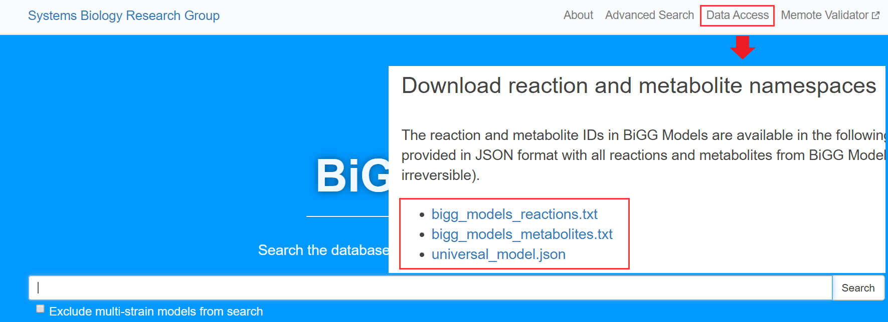
## KEGG 数据库信息下载
数据库网址 https://www.genome.jp/kegg/  。 利用 bioservices package 下载反应和代谢物信息
利用以下代码即可提取信息并存储到txt文件中
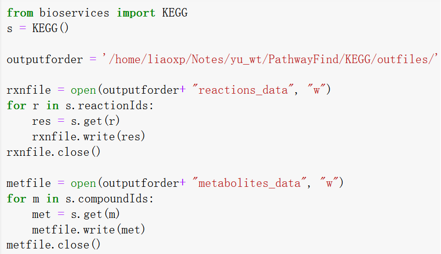
## MetaCyc数据库信息下载
数据库网址 https://metacyc.org/ 。数据库的反应和代谢物信息获取方式有两种。    
第一种：http://bioinformatics.ai.sri.com/ecocyc/dist/flatfiles-52983746/ ，进入此网址，登录（Username: biocyc-flatfiles ， Password: data-20541），然后下载最新版的MetaCyc数据。从下载的SBML文件中提取信息。
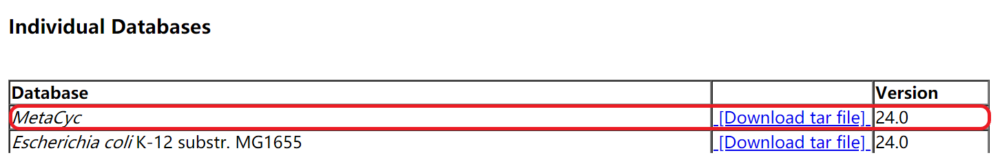
第二种：利用Pathway Tools工具下载。http://bioinformatics.ai.sri.com/ptools/dist-473256968.html ， 进入网站，登录（Username: ptools-runtimes ， Password: runtimes-14285），下载对应系统的软件版本。下载好之后，打开 Pathway Tools v24.0 , 选择MetaCyc, 菜单栏 File-->Export-->Generate SBML File For-->Selected Reactions-->选取存储路径-->文件命名-->OK。从得到的SBML文件提取信息即可。
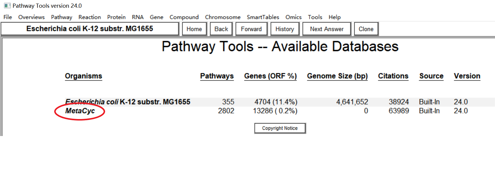
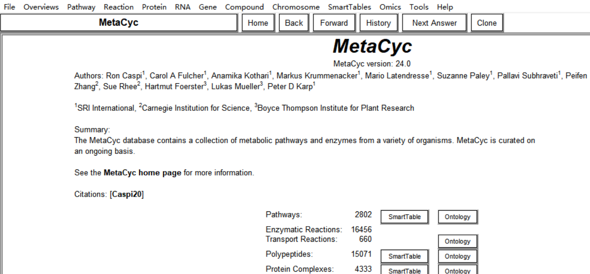
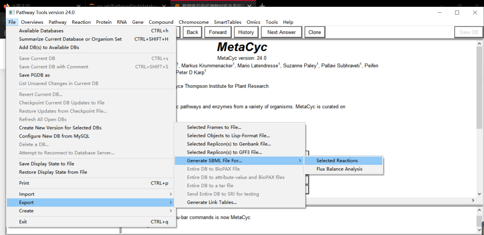
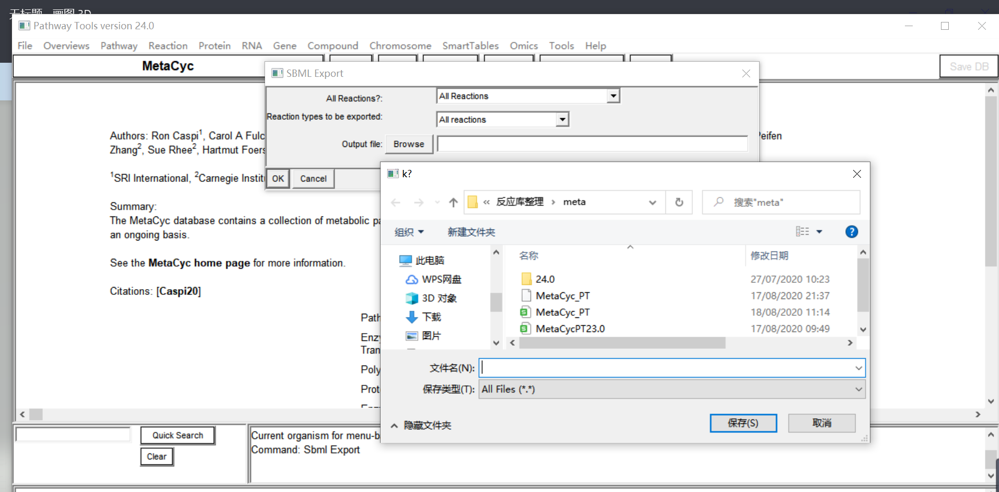
第二种方法获取的信息比第一种更全。
## Rhea数据库信息下载
数据库网址：https://www.rhea-db.org/ 。数据库反应信息获取方式：https://sparql.rhea-db.org/sparql ，进入此网址，点击右边 Examples 中第一个下的 Show，在 Result Format 中选择导出文件格式，点击 Run Query即可。其中命令行中的 ?reaction rh:status rh:Approved 是说明下载的反应状态的，如果不要求，可以删除这一句。
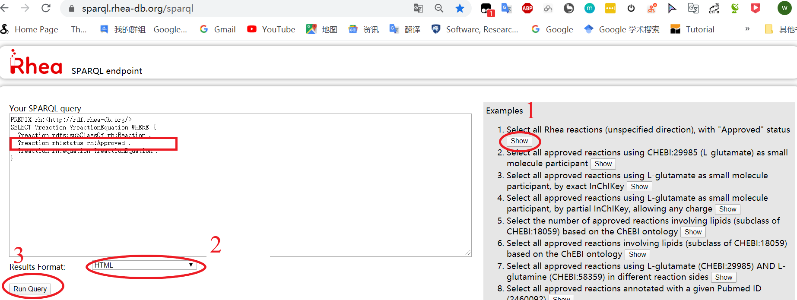
Rhea 仅提供了反应对应信息，该信息获取方式：点击网站菜单栏 Download ，页面最下方Cross-references 中的文件 rhea2xrefs.tsv 文件提供了对应关系。
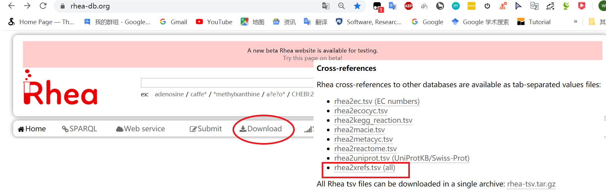
## ModelSEED数据库信息下载
数据库网址：https://modelseed.org/genomes/ 。反应代谢物信息获取：https://github.com/ModelSEED/ModelSEEDDatabase ，进入Github项目，打开 Biochemistry, 下载 compounds.tsv 和 reactions.tsv 文件。
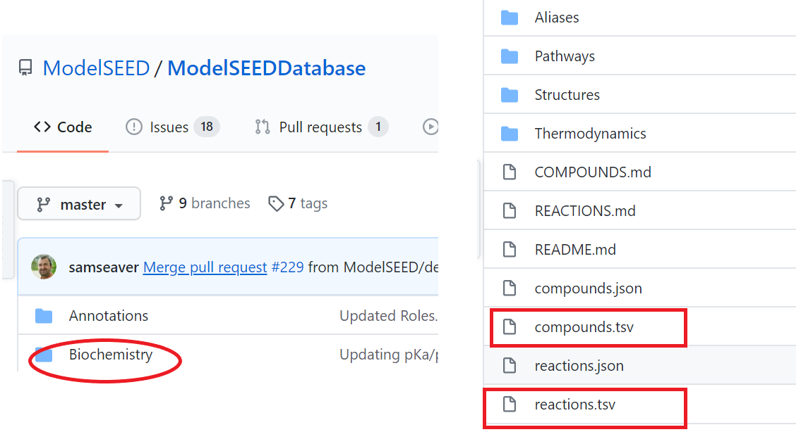
## MetaNetX数据库信息下载
数据库网址：https://www.metanetx.org/ 。点击左边菜单栏 Utilities 下的 Search/Download MNXref namespace , 然后点击 Previous releases 下的 MNXref FTP ,即可看到不同版本的 MetaNetX 数据信息。选择最新版本的文件夹打开，下载全部文件。其中 _depr 文件是id版本的迭代信息，_prop 文件是具体的信息，_xref 文件是不同数据库间的对应关系。
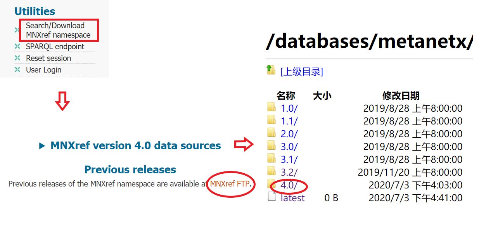